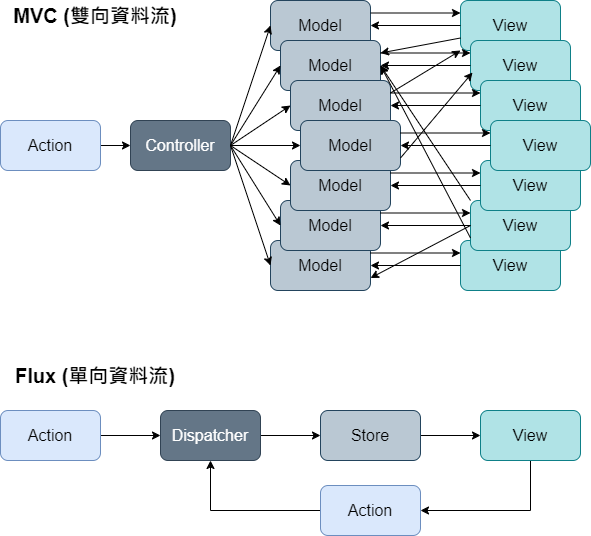

# 單向資料流
https://vuejs.org/guide/components/props.html#one-way-data-flow
```js
const props = defineProps(['foo'])

// ❌ 不可直接變更 props!
props.foo = 'bar'
```
## Flux
Flux 是一種設計模式。這個概念由 Facebook 提出，最核心的思想就是確保資料在應用程序中的流動方向是單向的。以避免雙向資料流所可能帶來的維護問題。



Flux 明確定義不同角色的職責和互動方式，幫助開發者更清晰地管理應用程序的狀態和資料流：
- ##### Action(動作)
  表示某個事件或操作，通常由使用者或系統事件觸發，用來更新應用程序的狀態，所有改變資料的動作必須在這裡被定義和觸發
- ##### Dispatcher(分發器)
  將目前發生的 Action 通知給所有已註冊的 Store。它充當一個中央管理器，確保 Actions 被適當地傳遞給相關的 Stores。
- ##### Store(資料儲存)
  每個 Store 存儲特定部分的應用程序狀態，重要的是，Store 是唯讀的，提供 getter 方法供 View 存取，只能通過 Actions 來修改它的狀態。
- ##### View(視圖)
  根據資料渲染使用者界面，同時它也監聽事件並將事件映射到適當的 Actions。當使用者與 View 互動時，View 會生成對應的 Action 來觸發相應的變更。

## Props 依賴變數
### 有修改需求：以 props 初始化
在 setup 裡面直接取用一次
```js
const props = defineProps(['initialCounter'])
const counter = ref(props.initialCounter)

```
### 沒有修改需求：使用 props 計算結果
使用 computed
```js
const props = defineProps(['size'])
const normalizedSize = computed(() => props.size.trim().toLowerCase())
```

## v-model 語法糖
使用事件觸發上游資料變更，不違反單向資料流實作 two-way binding 語法糖
:::code-group
```html [元件]
<CustomInput
  :modelValue="searchText"
  @update:modelValue="newValue => searchText = newValue"
/>
```
```html [v-model]
<input v-model="searchText" />
```
```html [input]
<!--input 在 vue 當中的地位比較特殊-->
<input
  :value="searchText"
  @input="searchText = $event.target.value"
/>
```
:::

這時候子元件長這樣，使用 getter, setter 讓 value 看起來可以像是直接修改(實際上遵循單向資料流)：
```html 
<!-- CustomInput.vue -->
<template>
  <input v-model="model" />
</template>

<script setup>
import { computed } from 'vue'

const props = defineProps(['modelValue'])
const emit = defineEmits(['update:modelValue'])

const model = computed({
  () => props.modelValue,
  (v) => emit('update:modelValue', v)
});
</script>
```
## 綁定多個 v-model 
父元件：
```html
<UserName
  v-model:first-name="first"
  v-model:last-name="last"
/>
```
子元件：
```html
<template>
  <input
    type="text"
    :value="firstName"
    @input="$emit('update:firstName', $event.target.value)"
  />
  <input type="text" v-model="firstName" />
</template>

<script setup>
import { computed } from 'vue'
const props = defineProps({
  firstName: String,
  lastName: String
});

const emit = defineEmits(['update:firstName', 'update:lastName']);

const firstName = computed({
  () => props.firstName,
  (e) => emit('update:firstName', e.target.value)
});
const lastName = computed({
  () => props.lastName,
  (e) => emit('update:lastName', e.target.value)
});
</script>
```
## v-model modifiers
## Reference
- [Vue.js-Component v-model](https://vuejs.org/guide/components/v-model.html)
- [Medium-深入淺出 Flux](https://medium.com/4cats-io/%E6%B7%B1%E5%85%A5%E6%B7%BA%E5%87%BA-flux-44a48c320e11)