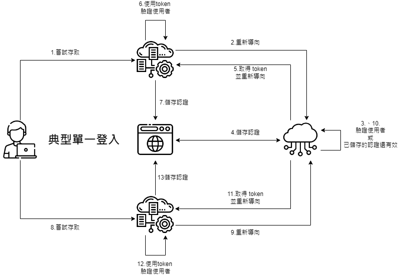

## SSO
在典型的單一登入模型中，前端的路由設置常使用 History 模式，這是為了避免重新導向時的問題。如果使用 Hash 模式，當重新導向發生時，重新導向後的路由資訊可能會丟失。而使用 History 模式則可以更好地處理重新導向，確保路由資訊的完整性。

P.S. 單頁應用程式 (SPA) 通常使用 Code Flow 進行身份驗證。"Code Flow" 是單一登入 (Single Sign-On, SSO) 中的一種授權流程，在這個流程中，前端程式接收表示密鑰的 Code，接著與 OpenID Connect (OIDC) 伺服器交換以獲取 Token。此 Token 作為憑證，用於對 API 發起請求。

## 缺少身份驗證伺服器的解決方案

目前情況摘要：
1. 目前尚未建立身份驗證伺服器。
2. 登入的規範要求接收一種名為「KEY」的值，類似於代碼（code）的內容。

目前可採取的解決策略：
1. 建立一個專門為「KEY」而設的登入入口，以免每個前端應用都需自行實現登入頁面和 KEY 請求的邏輯。
2. 建立一個簡易交換 token 的 api。

## 安全風險：
1. 解密端點暴露：任何人取得網址列回傳的加密字串(瀏覽記錄、伺服器日誌)，都能夠透過解密端點取得機密資訊。
2. 加密端點暴露：若加密操作缺乏任何形式的驗證機制，意味只要輸入任何使用者代號，即可向加密端點發送加密請求，並獲得相應的加密字串。

## Reference
- [RFC6749 - The OAuth 2.0 Authorization Framework](https://datatracker.ietf.org/doc/html/rfc6749)
- [RFC6750 - The OAuth 2.0 Authorization Framework: Bearer Token Usage](https://datatracker.ietf.org/doc/html/rfc6750)
- [RFC6819 - OAuth 2.0 Threat Model and Security Considerations](https://datatracker.ietf.org/doc/html/rfc6819)