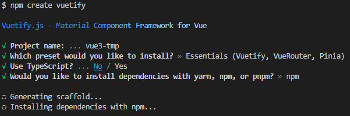
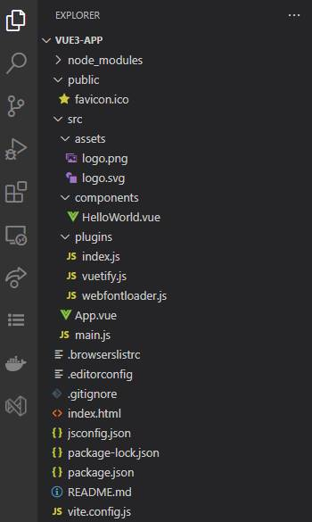

<script setup lang="ts">
</script>
# 建立專案
## 建立專案
1. 輸入指令建立專案   
   ```bash
   npm create vuetify
   ```
2. 設定項目：  
   - 輸入**專案名稱(這裡用 vue3-app)**
   - 選擇 Essentials (Vuetify, VueRouter, Pinia)
   - Use Typescript 選 **No**
   - 安裝程式選 **npm** 或 **yarn**(若有安裝)。    

     
3. vuetify-cli 在建立完專案之後就會自動安裝套件...
     

## 啟動專案
1. 進入專案資料夾 
   ```bash
   cd v3-app
   ```
2. 以 VSCode 打開專案 
   ```bash
   code . 
   ```
3. ``` ctrl+` ```打開 console
4. 啟動開發伺服器
   ```bash
   npm run dev
   ```  
   結果：  
    
5. 瀏覽器打開網址 `http://localhost:3000/`
   

## 專案架構


## Reference
- [Vuetify-next](https://next.vuetifyjs.com/en/getting-started/installation/)
