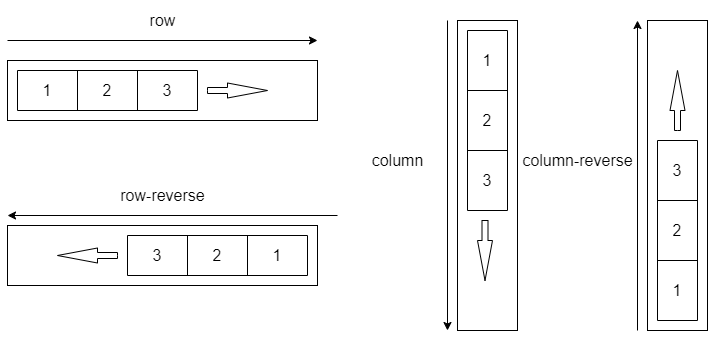

# 網格系統(Grid System)
網格系統用於網頁版面的分割、組織，目前前端UI框架(例如 Bootstrap、Vuetify 等)的網格系統多數採用了Flex布局，三種主要的布局方式分別是：

| 布局方式 | 概念                                                                                                      | 相容性                                                                                                                         |
| -------- | --------------------------------------------------------------------------------------------------------- | ------------------------------------------------------------------------------------------------------------------------------ |
| Float    | 將元素浮動到左側或右側實現多列布局。                                                                      | 較早的網頁佈局技術，可以支援較古老的瀏覽器(甚至包括IE 9)。                                                                     |
| Flex     | 基於「彈性盒子」概念，使得元素在**一個維度**上靈活排列、對齊和分佈。                                      | 當前**主流布局技術**                                                                                                           |
| Grid     | 基於網格和單元格的概念的**多維度***布局方式，元素可以在水平和垂直方向上同時進行精確的位置控制和大小調整。 | 現代瀏覽器中得到廣泛支援，但在舊版本的瀏覽器上相容性可能較差。然而，它被視為未來的主要布局方式，因為它提供了更大的彈性和控制。 |

## 彈性佈局模式(Flexbox)
### flex-direction: 
 

### 基本設置
使用Flex佈局的基本設置：  
 1. 設置容器的display屬性為flex或inline-flex，將容器元素定義為Flex容器（flex container）。
 2. 將容器內的元素設置為Flex項目（flex item），並指定它們的佈局規則。
```css
/*
 ====== 1. 將容器元素定義為Flex容器（flex container）======
 */
.container {
  display: flex; /* 或 inline-flex，取決於需要 */
}

/*
 ====== 2. 指定容器內的元素的佈局規則。======
*/
.item1 {
  /* 百分比在Flex Grid System中用於定義網格列的寬度。每個列可以指定一個百分比，表示該列在容器內所佔的比例。
  例如，如果有一個包含三個元素的容器，並且每個元素的寬度都設置為33%，那麼它們將平均佔據容器的寬度的33%。 */
  flex: 50%; /* 寬度為父容器寬度的50% */
}
.item2 {
  /* 固定寬度為100像素 */
  width: 100px; 
}
.item3 {
  /* 不指定的情況下，增長因子為0，不分配額外空間 */
}
```

### 增長因子(flex-grow)
Grow屬性指定了每個網格列在可用空間超過其實際寬度時，如何分配額外的空間。這是一個非負整數。
如果一個列的Grow屬性設置為1，而其他列的Grow屬性都設置為0，那麼當有額外空間時，該列將會增長，而其他列將保持不變。如果所有列都設置為1，它們將平均分享額外的空間。
```css
.item1 {
  flex-grow: 0; /* 不允許增長 */
}

.item2, .item3 {
  flex-grow: 1; /* 增長因子為1 */
}
```

[MDN-flex grow](https://developer.mozilla.org/en-US/docs/Web/CSS/flex-grow)
### 收縮因子(flex-shrink)
Shrink屬性指定了每個網格列在可用空間小於其實際寬度時，如何分配缺少的空間。這也是一個非負整數。
如果一個列的Shrink屬性設置為1，而其他列的Shrink屬性都設置為0，那麼當可用空間不足時，該列將縮小，而其他列將保持不變。如果所有列都設置為1，它們將平均分享缺少的空間。
```css
.item1 {
  flex-shrink: 1; /* 收縮因子為1 */
}

.item2, .item3 {
  flex-shrink: 0; /* 不允許收縮 */
}
```
[MDN-flex shrink](https://developer.mozilla.org/en-US/docs/Web/CSS/flex-shrink)

### flex-basis
用於指定項目的基礎大小，即項目在沒有額外空間或超過它的空間時的初始大小。默認值為auto，表示由項目的內容決定。

### flex shorthand property
```css
.item {
  flex: <flex-grow> <flex-shrink> <flex-basis>;
}
```
[MDN-Shorthand Properties](https://developer.mozilla.org/en-US/docs/Web/CSS/Shorthand_properties)

## 彈性網格系統(Flex Grid System)
以 bootstrap 為例，經典的網格系統長這樣：
```css
.col { flex: 1 0 0%; } /*增長因子為 1，會長大*/ 
/* col-1 ~ col-12 固定百分比 */
.col-auto{flex:0 0 auto;width:auto}
.col-1{flex:0 0 auto;width:8.33333333%}
.col-2{flex:0 0 auto;width:16.66666667%}
.col-3{flex:0 0 auto;width:25%}
.col-4{flex:0 0 auto;width:33.33333333%}
.col-5{flex:0 0 auto;width:41.66666667%}
.col-6{flex:0 0 auto;width:50%}
.col-7{flex:0 0 auto;width:58.33333333%}
.col-8{flex:0 0 auto;width:66.66666667%}
.col-9{flex:0 0 auto;width:75%}
.col-10{flex:0 0 auto;width:83.33333333%}
.col-11{flex:0 0 auto;width:91.66666667%}
.col-12{flex:0 0 auto;width:100%}
```
## Vuetify 網格系統

| 元件     | 作用                                                                                                                                                               | 重要屬性          | 替代 1.x 的內容 |
| -------- | ------------------------------------------------------------------------------------------------------------------------------------------------------------------ | ----------------- | --------------- |
| v-row    | 宣告 flex 容器，包裝v-col                                                                                                                                          | dense, no-gutters | v-layout        |
| v-col    | 必須是 v-row 的直接子元素                                                                                                                                          |                   | v-flex          |
| v-spacer | 分配剩餘的寬度，子元件之前或之後放置單個 v-spacer 時，這些元件將推向其容器的右側和左側。當在多個元件之間使用多個 v-spacer 時，剩餘的寬度將均勻分佈在每個間距之間。 |                   |                 |

## 對齊
### [Align](https://vuetifyjs.com/en/components/grids/#align)
### [Justify](https://vuetifyjs.com/en/components/grids/#justify)
### [Align Self](https://vuetifyjs.com/en/styles/flex/#flex-align-self)
### [Auto Margins](https://vuetifyjs.com/en/styles/flex/#auto-margins)

## Reference
- [MDN-Basic concepts of flexbox](https://developer.mozilla.org/en-US/docs/Web/CSS/CSS_flexible_box_layout/Basic_concepts_of_flexbox)
- [Bootstrap 5](https://getbootstrap.com/docs/5.0/getting-started/introduction/)
- [MDN-Shorthand_properties](https://developer.mozilla.org/en-US/docs/Web/CSS/Shorthand_properties)
- [Vuetify-Grid System](https://vuetifyjs.com/en/components/grids/)