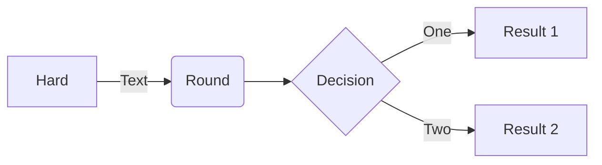
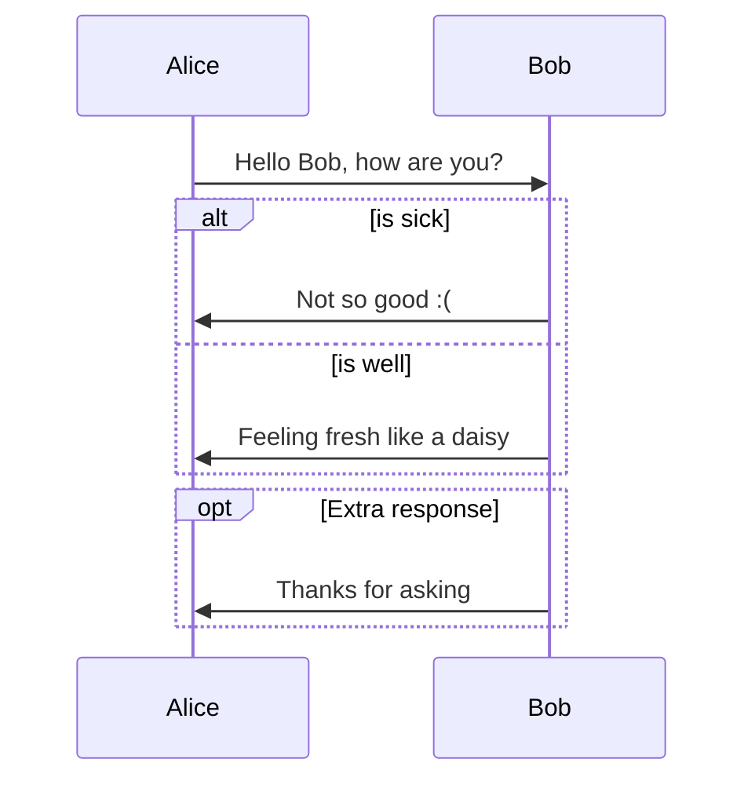

文件閱讀
資料表
Dialog
Form

props/event/attribute
provide/inject
default/named slot
component reference
async component
wrapper component ( redefine props/event )
父子組件溝通
常見錯誤：v-model 綁定到 props 上

component global/business relevant 

